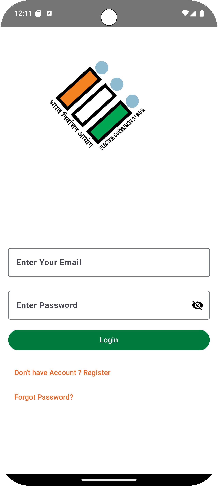
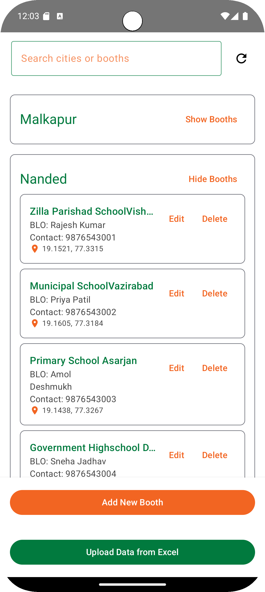
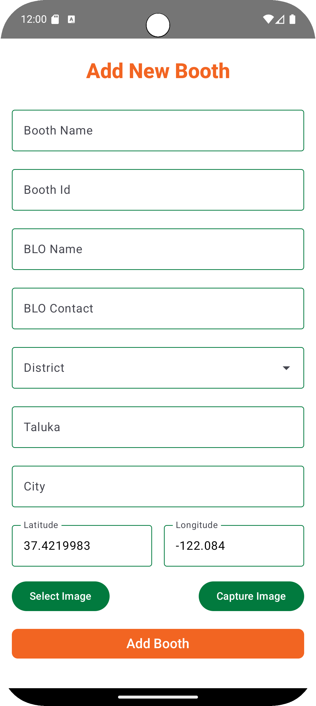
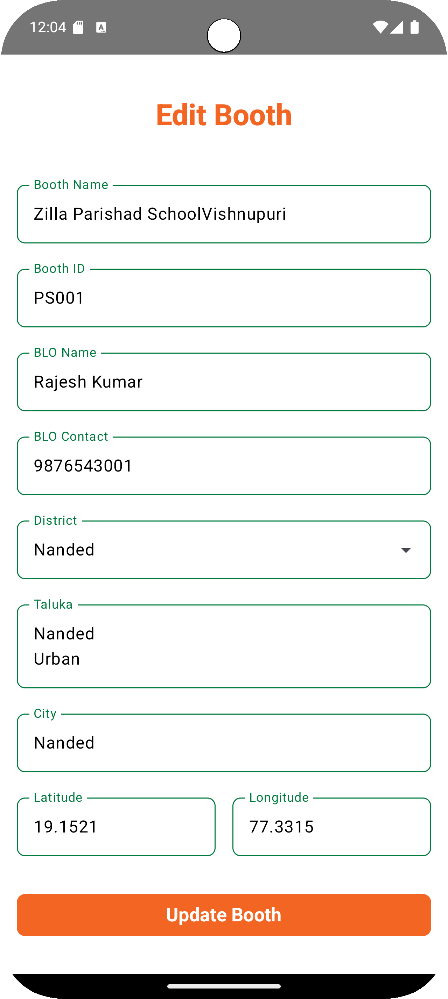
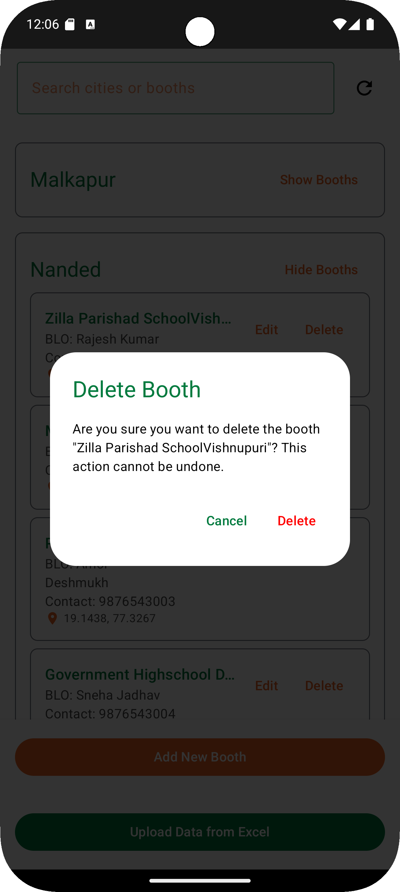

[# 📍 BoothMap Admin App

An Android application designed for election administrators to manage **voting booth data** efficiently.  
Admins can **add**, **edit**, **delete**, and **bulk upload** booth details with ease using a clean, user-friendly interface.

---

## 🧠 About the Project

**BoothMap Admin** is part of the *BoothMap ecosystem*, which helps visualize and manage all voting booths on a map.  
This **Admin app** provides CRUD (Create, Read, Update, Delete) functionalities and allows bulk data management for efficient election administration.

---

## ✨ Features

- ➕ **Add Booth Data** – Add voting booth information one by one with detailed fields
- 📤 **Bulk Upload** – Upload multiple booths at once using CSV/Excel files
- ✏️ **Edit Booth** – Update booth information anytime with real-time sync
- 🗑️ **Delete Booth** – Remove booth data when no longer needed
- 🔍 **Search & Filter** – Quickly find specific booths using search functionality
- ☁️ **Firebase Integration** – Real-time cloud database for instant updates
- 🌐 **User-Friendly Interface** – Clean and intuitive admin dashboard
- 🔐 **Secure Access** – Admin authentication for data protection

---

## 🧩 Tech Stack

| Technology | Description |
|-------------|-------------|
| **Kotlin + Jetpack Compose** | Modern Android UI framework for declarative interfaces |
| **Firebase Firestore** | Cloud NoSQL database for real-time booth data storage |
| **Firebase Storage** | Store CSV/Excel files and booth images |
| **MVVM Architecture** | Clean and maintainable code structure |
| **Material Design 3** | Beautiful and consistent UI components |
| **Coroutines** | Asynchronous programming for smooth performance |

---

## 📱 Screenshots

|Login | Home | Add Booth | Edit Booth | Delete Booth | 
|:--------------:|:----------:|:------------:|:-----------:|:--------------:|
| |  |  |  |  |


---

## ⚙️ Installation

### 1. Clone this repository
```bash
git clone https://github.com/<your-username>/BoothMapAdmin.git
cd BoothMapAdmin
```

### 2. Open in Android Studio
- Go to **File → Open → BoothMapAdmin**
- Let Gradle sync automatically

### 3. Set up Firebase
- Create a Firebase project at [Firebase Console](https://console.firebase.google.com/)
- Enable **Firestore** and **Firebase Storage**
- Download your `google-services.json` file
- Place it inside the `app/` directory

### 4. Configure Firebase Rules
Add these Firestore security rules:
```javascript
rules_version = '2';
service cloud.firestore {
  match /databases/{database}/documents {
    match /booths/{boothId} {
      allow read, write: if request.auth != null;
    }
  }
}
```

### 5. Run the App
- Select a device/emulator
- Click **▶️ Run** to launch the application

---

## 📂 Project Structure (MVVM)

```
BoothMapAdmin/
│
├── data/
│   ├── model/              # Data classes (Booth, Admin, etc.)
│   ├── repository/         # Firebase CRUD operations
│   └── local/              # Local database (Room - optional)
│
├── ui/
│   ├── screens/            # Compose UI screens
│   │   ├── Dashboard.kt
│   │   ├── AddBooth.kt
│   │   ├── EditBooth.kt
│   │   ├── BoothList.kt
│   │   └── BulkUpload.kt
│   ├── components/         # Reusable Compose components
│   └── navigation/         # Navigation graph
│
├── viewmodel/              # ViewModels for data handling
│   ├── BoothViewModel.kt
│   ├── BulkUploadViewModel.kt
│   └── AuthViewModel.kt
│
├── utils/                  # Helpers and extensions
│   ├── CSVParser.kt
│   ├── Constants.kt
│   └── ValidationUtils.kt
│
└── MainActivity.kt         # Entry point
```

---

## 🔧 Prerequisites

- **Android Studio** Arctic Fox or later
- **Android SDK** 24 or higher
- **Firebase Account** with Firestore enabled
- Internet connection for Firebase operations

---


## 📊 Bulk Upload Format

### CSV File Structure
```csv
booth_number,booth_name,address,district,pincode,latitude,longitude
001,Booth Name 1,Address Line 1,District Name,411001,18.5204,73.8567
002,Booth Name 2,Address Line 2,District Name,411002,18.5304,73.8667
```

### Required Fields
- `booth_number` – Unique booth identifier
- `booth_name` – Name of the voting booth
- `address` – Complete address
- `district` – District name
- `pincode` – 6-digit postal code
- `latitude` – GPS latitude coordinate
- `longitude` – GPS longitude coordinate

---

## 🚀 Future Enhancements

- 📍 **Google Maps Integration** – Visualize booth locations on an interactive map
- 🧾 **Excel Export** – Download booth data in Excel format
- 🔐 **Multi-Admin Support** – Role-based access control for multiple administrators
- 📊 **Analytics Dashboard** – View statistics and insights about booth distribution
- 🔔 **Push Notifications** – Alert admins about important updates
- 📱 **Offline Mode** – Work without internet and sync later
- 🗺️ **Route Planning** – Optimize routes for booth visits
- 📸 **Image Upload** – Add booth photos for better identification
- 🌍 **Multi-Language Support** – Add regional language options

---


## 📝 License

This project is licensed under the **MIT License** – see the [LICENSE](LICENSE) file for details.

---

## 🧑‍💻 Developed By

**Jaykumar Gupta**  
- **President** – SWAG (SGGS Web, App & Game Development Club)  
- **App Head** – Google Developer Group (GDG SGGS)  
- 🎓 SGGSIE&T, Nanded

### 📬 Contact
- 📧 Email: [jaykumar636904@gmail.com](mailto:jaykumar636904@gmail.com)
- 💼 LinkedIn: [Jaykumar Gupta](https://www.linkedin.com/in/jaykumar-gupta-aba7312a7)


